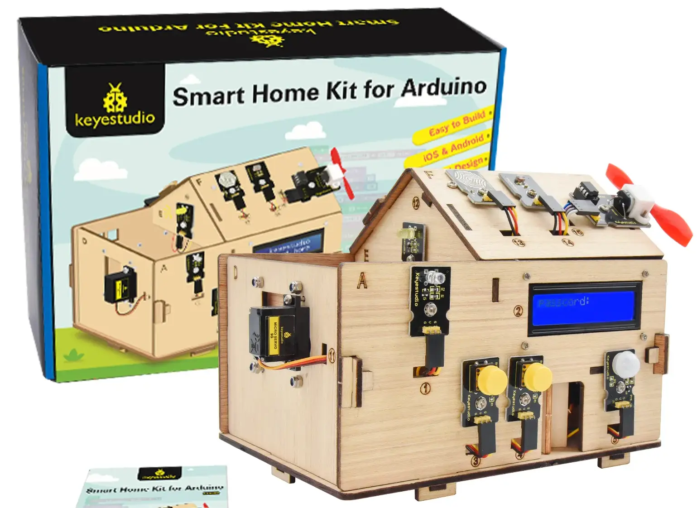

# Geekhouse IoT Server

I was looking for a set of sensors to demonstrate some IoT concepts.
When I found this kit on Amazon I decided it's perfect for the job.
It's one thing to work with a bunch of sensors connected to your breadboard, but it's so much more fun to have a real _tangible_ object to control.



## Features

- HATEOAS-compliant REST API
- Modular architecture
- Sensor calibration support
- Dynamic device configuration
- Flexible device management
- Support for multiple sensor types and actuators

## Hardware Requirements

- Raspberry Pi Pico W (or compatible microcontroller)
- Supported sensors:
  - ADC-based sensors (light, temperature)
  - Digital sensors (touch, motion)
- Supported actuators:
  - LEDs
  - DC motors
  - Servo motors
  - Stepper motors
  - Buzzers

## Software Requirements

- MicroPython (Latest version recommended)
- Microdot web framework
- Development machine with Python 3.x (for configuration tools)

## Project Structure

```none
├── config                         # Configuration files
│   └── config_example.toml
├── deploy                         # Deployment scripts
│   ├── deploy.sh
│   └── toml_to_json.py
├── geekhouse.code-workspace       # Cursor/VS Code workspace
├── images                         # Images
│   └── smart_home_kit.webp
├── mp_requirements.txt              # MicroPython requirements
├── Pipfile                        # Python dependency file
├── Pipfile.lock                   # Python dependency lock file
├── README.md                      # This file
└── src                            # Source code
    ├── config_handler.py
    ├── main.py
    ├── routes.py
    ├── server.py
    └── utils.py
```

## Installation

1. Install MicroPython on your Pico W. Follow the instructions [here](https://docs.micropython.org/en/latest/rp2/quickref.html#installation).

1. Clone this repository

   ```bash
   git clone https://github.com/pavelanni/geekhouse.git
   cd geekhouse
   ```

1. Configure your server

   - Copy `config_example.toml` to `config.toml` and edit with your settings.
   - Most importantly, set your WiFi credentials.

1. Create a virtual environment and install `mpremote`

   Use `pipenv`

   ```bash
   pipenv install # It will use the provided Pipfile
   pipenv shell
   ```

   Or use `pip`

   ```bash
   python -m venv venv
   source venv/bin/activate
   pip install mpremote
   ```

1. Upload files to Pico W using the deployment script

   ```bash
   ./deploy/deploy.sh
   ```

## Configuration

### Device Configuration (config.toml)

```toml
# WiFi Configuration
[wifi]
ssid = "YourSSID"
password = "YourPassword"

# Server Configuration
[server]
port = 80

# LED Configuration
[leds.yellow_roof]
pin = 2
color = "yellow"
location = "roof"
type = "led"

# Sensor Configuration
[sensors.roof_light]
pin = 0
type = "light"
location = "roof"
unit = "lux"
adc = true

[sensors.roof_light.config]
type = "polynomial"
params = { coefficients = [0.0, 0.1] }
```

## API Documentation

### Root Endpoint

```http
GET /
Response: {
  "data": {"message": "Welcome to IoT API"},
  "_links": {
    "self": {"href": "/"},
    "leds": {"href": "/leds"},
    "sensors": {"href": "/sensors"},
    "status": {"href": "/status"}
  }
}
```

### LED Endpoints

- GET `/leds` - List all LEDs
- GET `/leds/filter?color={color}&location={location}` - Filter LEDs
- POST `/leds/{id}/toggle` - Toggle LED state

### Sensor Endpoints

- GET `/sensors` - List all sensors
- GET `/sensors/filter?type={type}&location={location}` - Filter sensors
- GET `/sensors/{id}/value` - Get sensor reading
- GET `/sensors/{id}/config` - Get sensor configuration
- POST `/sensors/{id}/config` - Update sensor configuration

## Usage Examples

### Reading a Sensor

```python
import requests

# Get sensor reading
response = requests.get('http://your-device-ip/sensors/roof_light/value')
data = response.json()
print(f"Light level: {data['data']['calibrated_value']} {data['data']['unit']}")
```

### Controlling an LED

```python
import requests

# Toggle LED
response = requests.post('http://your-device-ip/leds/yellow_roof/toggle')
data = response.json()
print(f"LED state: {'ON' if data['data']['state'] else 'OFF'}")
```

## Development

### Adding New Sensors

1. Add sensor configuration to `config.toml`
1. Upload new configuration to device (the deployment script will handle conversion from TOML to JSON)

### Implementing New Features

1. Modify appropriate module
1. Test locally if possible
1. Upload changes to device
1. Test on device

## Troubleshooting

### Common Issues

1. WiFi Connection Fails
   - Check SSID and password
   - Verify WiFi signal strength
   - Check router settings

1. Sensor Reading Errors
   - Verify wiring
   - Check pin configurations
   - Validate calibration settings

1. Server Not Responding
   - Check IP address
   - Verify port settings
   - Check network connectivity

## Contributing

1. Fork the repository
1. Create your feature branch
1. Commit your changes
1. Push to the branch
1. Create a Pull Request

## Educational Use

This project is designed for teaching:

- IoT fundamentals
- REST API design
- HATEOAS principles
- Sensor integration
- Device configuration
- Code organization

## License

This project is licensed under the MIT License - see the LICENSE file for details.

## Acknowledgments

- [MicroPython team](https://github.com/micropython/micropython)
- [Microdot team](https://github.com/miguelgrinberg/microdot)
- [Keyestudio](https://www.keyestudio.com/) for the smart home kit
